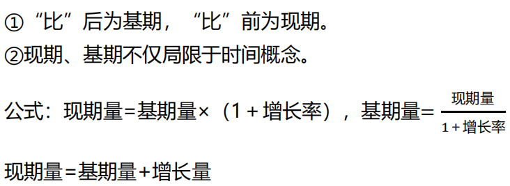
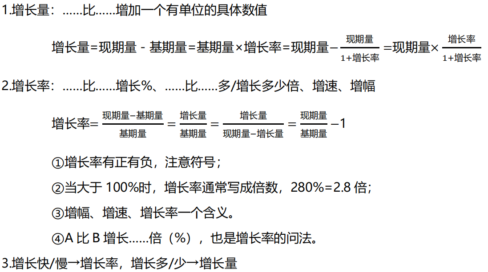

# 资料理论

## 现期量、基期量

## 增长量、增长率

## 同比、环比
同比：实际是指与去年的同一时期相比较。  
环比：与紧紧相邻的统计周期相比较。（统计周期：最小时间单位）
::: tip 公式
发展速度 = 现期量 / 基期量 = 增长率 + 1
:::

## 年均增长量
::: tip 公式
年均增长量 = (末期量 - 初期量) / 相差年数
相差年数 = 末期 - 初期（分子上实际用到的初期和末期直接相减）
:::
### 初期的确定方式
1. 时间若以“年末—年末”的形式给出，时间段的开头即为初期，末尾即为末期
2. 时间若以“年初—年末”的形式给出，初期需多向前考虑一个时期（用去年末替代）

## 年均增长率

## 拉动增长率（本质是增长率）
部分拉动整体增长了多少个百分点。
::: tip 公式
拉动增长率 = 部分增长量 / 整体基期量
:::

## 增长贡献率（本质是占比）
::: tip 公式
增长贡献率 = 部分增长量 / 整体增长量
:::

## 比重
A 占 B 的比重，B 中 A 的占比：“占”，占前为部分，占后为整体
::: tip 公式
比重 = 部分量 / 整体量  
整体量 = 部分量 / 比重  
部分量 = 整体量 × 比重
:::

## 平均数
标志：平均、均、每、单位
::: tip 公式
平均数 = 总数 / 总个数 = 后 / 前
:::

## 成数、翻番
成数：几成相当于十分之几  
翻番：翻一番为原来的 2 倍，翻 n 番变为原来的 2的n次方 倍

## 国内生产总值、国民生产总值
国内生产总值（GDP）= 第一产业增加值 + 第二产业增加值 + 第三产业增加值（增加值为专有名词，无特殊意义），一般服务业指的就是第三产业。  
国民生产总值（GNP）

## 顺差、逆差
描述进口额和出口额之间的关系
::: tip 公式
出口额 ＞ 进口额，顺差额 = 出口额 - 进口额  
出口额 ＜ 进口额，逆差额 = 进口额 - 出口额
:::

## 指数
假定基期是 100，其他量和基期相比得出的数值。
- 两期实际值之比 = 两期指数之比
- 指数 ＞ 100，增长；指数 ＜ 100，下降
- r =（指数 - 100）%

## 恩格尔系数
恩格尔系数 = 食品支出 / 消费支出，越小越好

## 基尼系数
代表贫富差距，越小越好

## 五年规划
- 十五：2001 - 2005 年
- 十一五：2006 - 2010 年
- 十二五：2011 - 2015 年
- 十三五：2016 - 2020 年

五年规划，只有求年均增长类才需要翻旧账。求总和、平均数不用翻
