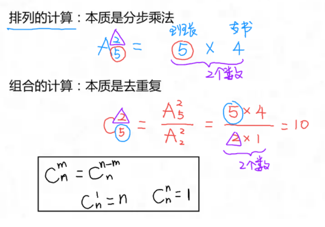
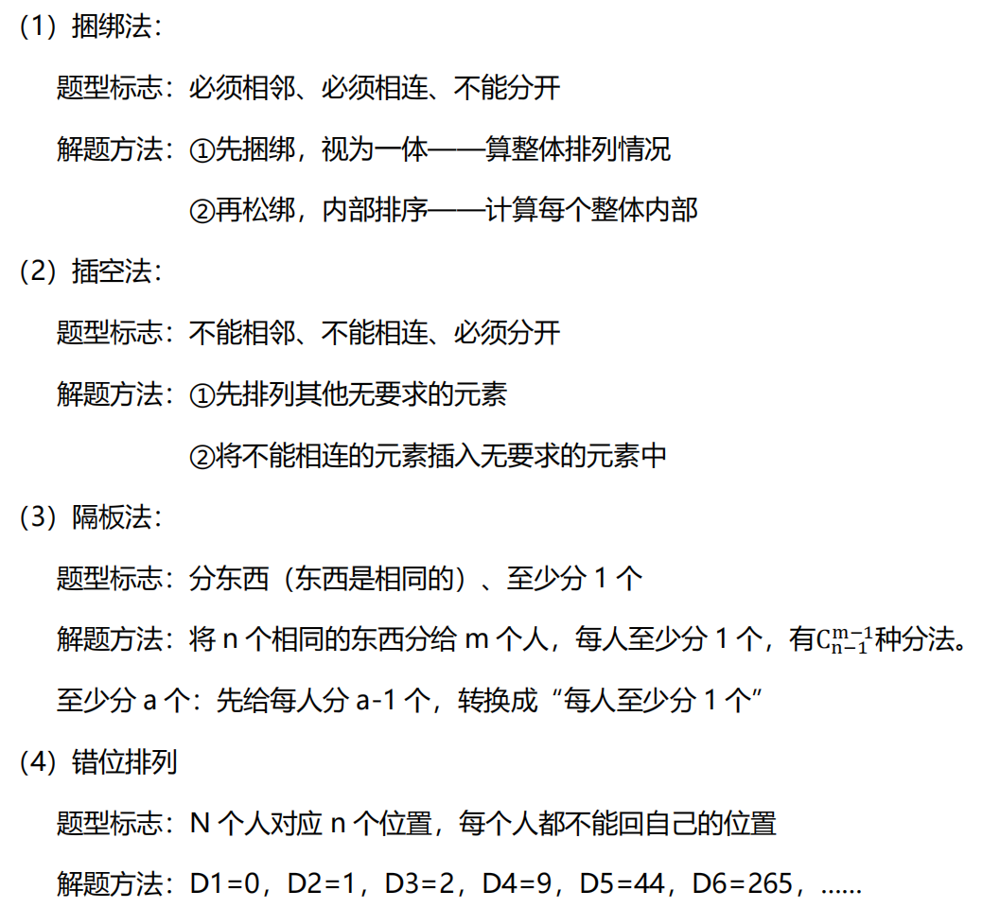
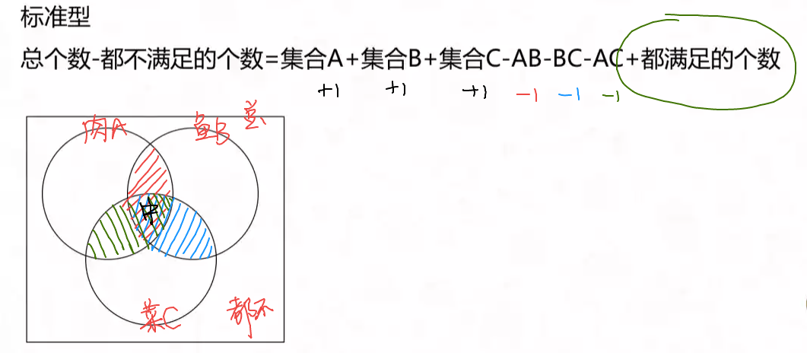

# 数量理论

## 工程问题
::: tip 核心公式
工作总量 = 工作效率 x 工作时间
:::
### 给定时间型
- 特征：
  - 题干中给出不同主体完成工作所需的时间，问题往往也问题时间
- 赋值法：
  - 把几个时间的公倍数作为工作总量
### 效率制约型
#### 多主体工作类
- 特征：
  - 题干中提及 N 个效率相同的主体一起工作
- 赋值法：
  - 赋值每个主体效率为 1
#### 效率成比例关系类
- 特征：
  - 题干中给出不同主体的效率间关系（比例、倍数等）
- 赋值法：
  - 赋值最简比例
### 循环做工型
- 解题方法：
  - 找到循环规律
  - 计算一个周期的工作量
  - 计算所需周期数及剩余量
  - 剩余量再分配
### 双人双工程型
- 解题方法：
  - 计算相对效率
  - 各自干擅长的
  - 强者干完帮助弱者

## 经济利润问题
::: tip 核心公式
利润 ＝ 售价 － 成本

打折：售价 × 折扣

利润率 ＝ 利润 ÷ 成本（数量关系）＝ 利润 ÷ 收入（资料分析）

总售价（销售额）= 单价 × 销量

总利润 ＝ 单利润 × 销量 ＝ 总收入 － 总成本
:::
### 利润折扣类
- 简单问题直接代公式
- 复杂问题列表分析
### 分段计费型
- 常见题型：
  - 分两段、分三段
- 解题方法：
  - 分几段就分别算几次
  - 加和即为总数
### 统筹优化型
1. 比总价
2. 比单价
3. 比优惠

## 行程问题
::: tip 核心公式
路程 ＝ 速度 × 时间

等距离平均速度 = 2v1v2 / v1+v2
:::
::: tip 单位
时间单位：1 小时=60 分=3600 秒

路程单位：1 千米=1 公里=1000 米

速度单位：1m/s=3.6km/h（例如 108km/h=30m/s）
:::
::: tip 常用方法
- 方程法
- 赋值法：
  - 给 v 赋值，最简比例
  - 给 S 赋值，公倍数赋值
- 图示法：
   - 画线段图；
   - 标明运动过程
- 比例法：
   - 路程一定时，速度与时间成反比
   - 速度一定时，路程与时间成正比
   - 时间一定时，路程与速度成正比
:::
### 火车过桥问题
- 火车完全`过桥（隧道）`
  - 总路程=桥（隧道）长+车长
- 火车完全`在桥上（隧道）`
  - 总路程=桥（隧道）长-车长
### 相遇追及问题
#### 相遇问题
- 运动方向相反
- 核心公式：
  - S＝（V1＋V2）× t
  - 相遇看和，S 为共走路程，V 看和
- 直线型多次相遇问题
  - 两端出发型：第 n 次相遇，共走（2n－1）S
  - 同端出发型：第 n 次相遇，共走 2nS
#### 追及问题
- 运动方向相同
- 核心公式：
  - S＝（V1－V2）×t
  - 追及看差，S 为多走路程，V 看差
#### 环形相遇
- 环形：封闭轨道
- 同点出发：
  - 追及：每追上一次，多跑一圈
  - 相遇：每相遇一次，共走一圈
### 流水行船问题
- 状态：
  - 顺流（V 船＋V 水）
  - 逆流（V 船－V 水）
  - 静流（V 船）
  - 漂浮（V 水）
- 核心公式：
  - 顺流：S＝（V 船＋V 水）×t 顺流
  - 逆流：S＝（V 船－V 水）×t 逆流

## 排列组合问题
- 排列：
  - 有顺序（交换顺序影响结果）
  - 用 A 表示
  - 标志词：安排、排列、顺序、序列
- 组合：
  - 无顺序
  - 用 C 表示
  - 标志词：选择、同样
### 排列组合的计算

### 分步与分类
- 分步：
  - 分步用乘法：不能独立完成整个事情，分步、用乘法（完成一件事的不同步骤）
- 分类：
  - 分类用加法：能独立完成整个事情，分类、用加法（完成一件事的不同类别）
### 特殊排列组合

::: tip 错位排列
第 n 项 = （n - 1）x 前两项的和
:::

## 概率问题
::: tip 核心公式
概率P ＝ 满足条件的情况数 ÷ 总情况数
:::
### 枚举概率
枚举法辅助求解概率问题
### 分步概率
★两人“在一起”的概率：P1×P2
### 分类概率
分类用加法，每类的概率相加
### 比赛概率
本质是分类概率

比赛最后一局的胜者就是比赛的最终胜者
### 逆向概率
正难则反：P 符合=1－P 不符合

## 几何问题
### 三角形
- 计算公式：
  - 周长 C ＝ a ＋ b ＋ c
  - 面积 S ＝ 1/2 x ah
- 性质：
  - 两边之和大于第三边，两边之差小于第三边
#### 有公共边的三角形
- 两个三角形，底相同，则面积之比等于高之比
- 两个三角形，高相同，则面积之比等于底之比
#### 相似三角形
- 判定方法：
  - 两个角相等；两边对应成比例且夹角相等
- 性质：
  - 周长之比＝对应边长之比＝相似比；
  - 面积之比＝相似比的平方
#### 直角三角形
- 勾股定理：
  - 斜边的平方＝直角边的平方和（c²=a²+b²）
- 30°，60°，90°直角三角形边长比例关系：
  - 1∶√3∶2
  - √3 ≈ 1.732
- 45°，45°，90°直角三角形边长比例关系：
  - 1∶1∶√2
  - √2 ≈ 1.414
#### 等腰三角形
底角、腰长相等，底边三线合一

顶角为 120°的等腰三角形，其`底边`长度为`腰长`的√3倍
#### 等边三角形
等边，等角，三边均三线合一

- 面积公式：√3 / 4 x a²
### 正方形
- 周长公式：
  - C＝4a
- 面积公式：
  - S＝a²
- 性质：
  - 四边相等；四角都为直角；对角线相等、平分、垂直
### 长方形
- 周长公式：
  - C＝2×（a＋b）
- 面积公式：
  - S＝ab
- 性质：
  - 对边相等；四角都为直角；对角线相等、平分
### 圆形
- 周长：
  - C＝2πr
- 面积：
  - S＝πr²
- 性质：
  - 圆的直径所对应得圆周角为直角
### 梯形
- 面积:
  - S = (a+b)h / 2
### 菱形
- 面积:
  - S = ah = l1 × l2 / 2 （对角线乘积的一半）
### 扇形
- 面积:
  - S= n° / 360° × πr²

## 立体几何
### 正方体
- 性质：
  - 6 个面，每个面相同；8 个顶点，12 条棱
- 表面积：
  - S＝6a²
- 体积：
  - V=a³
### 长方体
- 性质：
  - 6 个面，每组对面相同
- 表面积：
  - S＝2×（ab＋bc＋ac）
- 体积：
  - V＝abc
### 球
- 性质：
  - 直径 D＝2 × 半径R
- 表面积：
  - S＝4πR²
- 体积：
  - V= 3/4 x πR³
### 圆柱体
- 性质：
  - 上下底面形同，侧面展开是矩形
- 表面积：
  - S＝2πr²＋2πrh
- 体积：
  - V＝πr²h
### 圆锥（锥体）
- 性质：
  - 底面是圆形，侧面展开是扇形
- 表面积：
  - S＝πr²＋πrl
- 体积：
  - V＝1/3 x πr²h
- 锥体：
  - V＝ 1/3 × 底面积 × 高

## 几何构造
### 最短距离
- 点到点的最短距离——线段相连
- 点到直线的最短距离——垂线
- 一侧两点到直线距离和最短——做对称点
### 几何最值
- 四边形`周长`一定，越接近于`正方形面积越大`
- 四边形`面积`一定，越接近于`正方形周长越小`
- 平面图形`周长`一定，越接近于`圆面积越大`
- 平面图形`面积`一定，越接近于`圆周长越小`
- 几何体`表面积`一定，越接近于`球体积越大`
- 几何体`体积`一定，越接近于`球表面积越小`

## 容斥原理
- 本质：
  - 找到并去除重复的过程
### 两集合

### 三集合
#### 标准型
- 标志：
  - 满足两个条件（包含三者都）

#### 非标准型
- 标志：
  - “只”满足两个条件（不包含三者都）

::: tip 补充公式：
只满足1个条件的个数 + 只满足2个条件的个数 + 三者都满足的个数 + 三者都不满足的个数 ＝ 总个数
:::

## 最值问题
### 最不利构造
- 题型标志：
  - 至少……保证……
- 解题方法： 
  - ①构造最不利情形
  - ②正确答案＝最不利情况＋1
### 数列构造
- 题型本质：
  - 已知多项和，求某一项的最值
- 题型标志：
  - 最多的最少、最多的最多
  - 最少的最少、最少的最多
  - 排名第几的最多（少）
- 解题方法： 
  - ①排名定位
  - ②反向构造
  - ③加和求解
### 多集合反向构造
- 题型标志：
  - 都……至少……
  - 至少……都……
- 解题方法：
  - 反向——求和——做差
